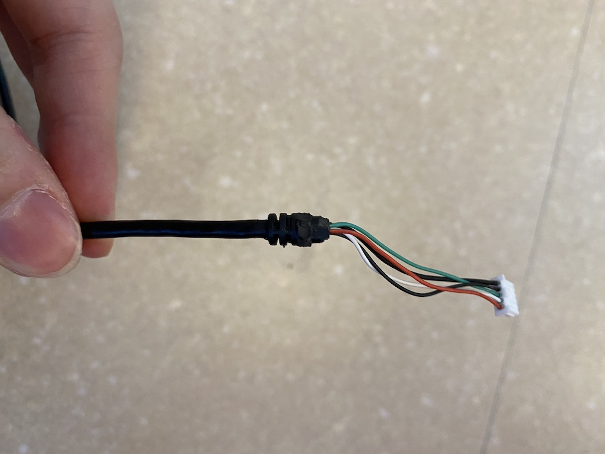
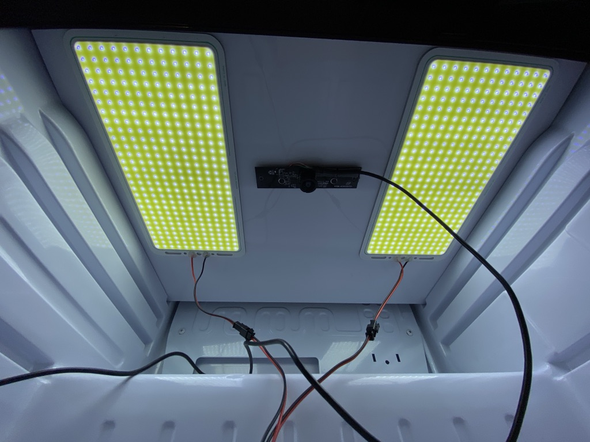
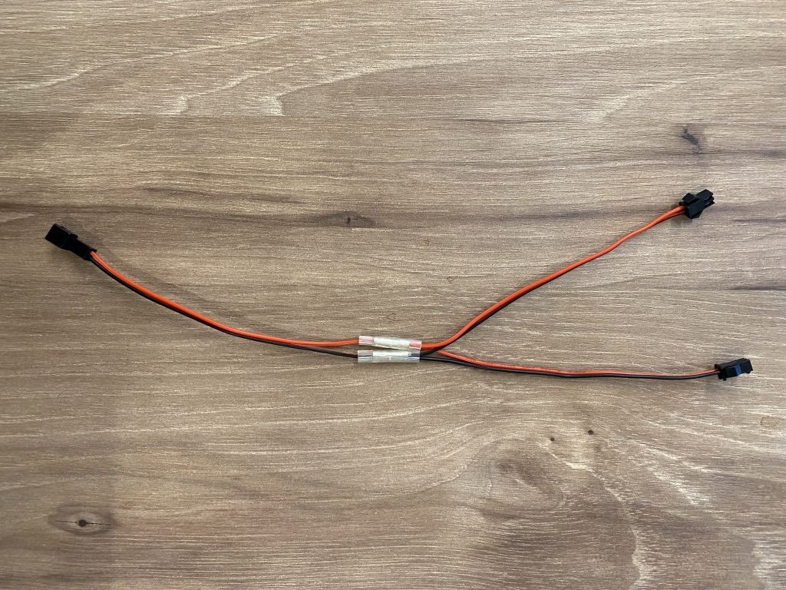
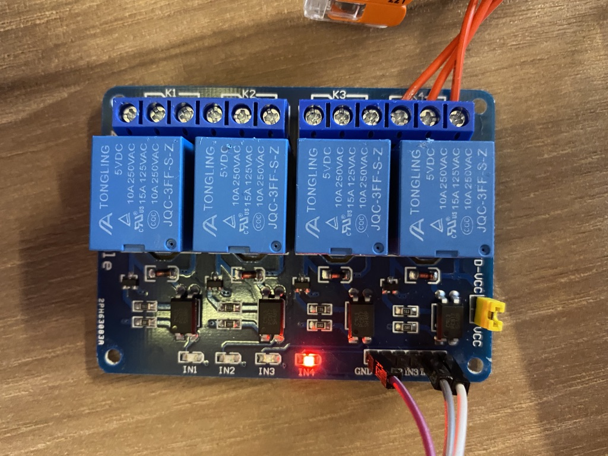
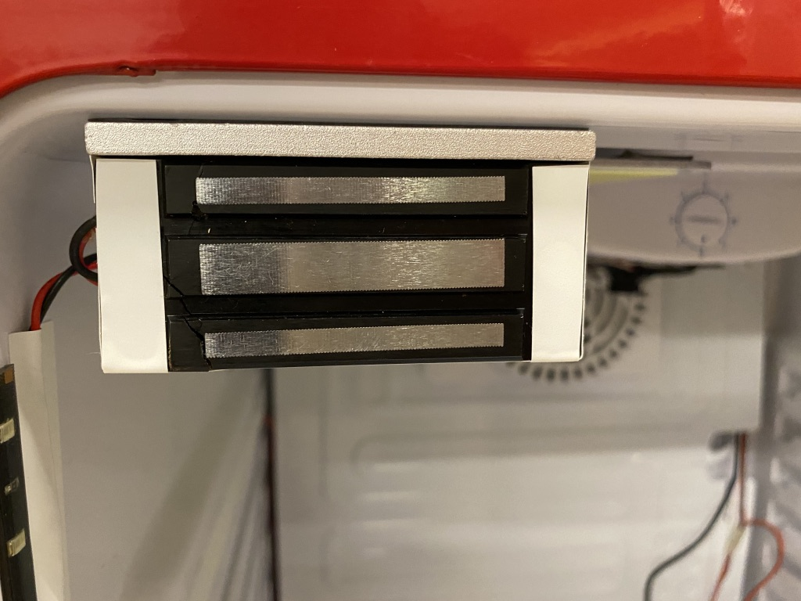
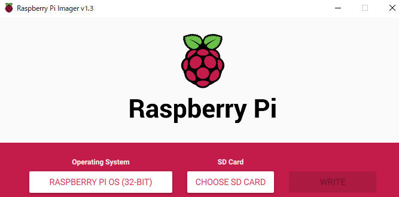
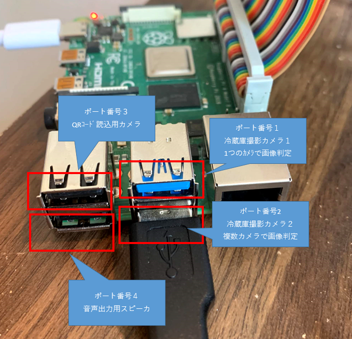
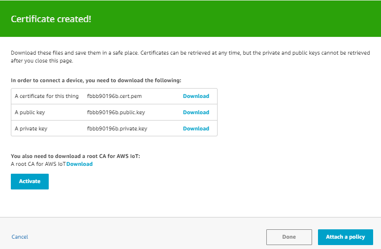
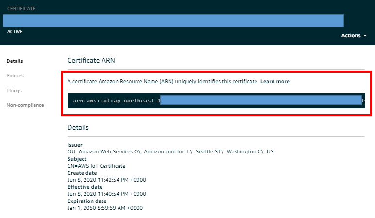
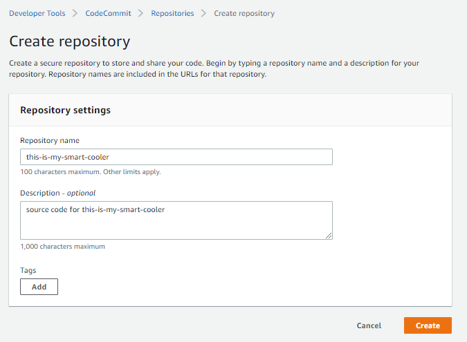

# レジ無し無人販売冷蔵庫 構築レシピ

## 本レシピの目的
本レシピを使用することで、IoT/ML/AIを使用したシステムを包括的に学習することが可能です。この学習の中で、お客様自身でレジ無し無人販売冷蔵庫を構築することを主眼に置いており、"自分で作る能力"の向上に繋がります。
結果として、本レシピで得たスキルを活用して、お客様自身でレジ無し無人販売冷蔵庫をカスタマイズし、実ビジネスで運用することを想定しています。  

## 何が構築されるのか?
レジ無し無人販売冷蔵庫を構築することが出来ます。
※レジ無し無人販売冷蔵庫(以降Smart Cooler)とは、IoT/ML/AIの技術を用いて、消費者が取り出したドリンクや食品を認識し決済まで完了させることで、支払いの手間のない購入体験ができる冷蔵庫です。

---
## 構築手順
レジ無し無人販売冷蔵庫の構築手順は大きく分けて5つの項目を実施します。

### 1. ハードウェアの構築

### 2. Raspeberry Pi インストール 

### 3. デバイス設定

### 4. デバイス用 サーバ証明書 & 秘密鍵 作成

### 5. ミドルウェア設定

### 6. AWSサービス設定

### 7. 物体検出モデル作成 Optional

### 8. CICD (Smart Cooler) Optional


---
## 1. ハードウェアの構築
### 部品の選定と調達
構成部品は[こちら](BOM.md)にまとめてあります。
このリストからお持ちでないものを事前に購入しておいてください。

### 仕切り板の設置
2段での構築を考えている場合には、ここの手順で仕切り板を挿入します。
1. 冷蔵庫付属の仕切り板は全て取り外します。
1. 購入した仕切り板を冷蔵庫の中頃に挿入して、サイズが合っているか確認します。


### カメラの取り付け


次に、庫内に商品認識用のカメラを設置します。

#### 選定
 カメラの選定と取り付け位置については、[こちら](BOM.md)のカメラの項目を参考にしてください。
この冷蔵庫の手法では、各段ごとにカメラが必要となるため、購入および設置するカメラの数は用意する段数と同じです。

#### 本体カバーの取り外し


カメラ高さを可能な限り低くするため、必要に応じてカメラを分解し、本体カバーなどを取り外してください。
こうすることによって、本体カバー分だけカメラの高さを幾分か低くすることができる場合があります。
カバーを取り外した場合は、必要に応じてマスキングテープなどでカメラ基板を保護します。


#### 冷蔵庫へ配線を通す
カメラのUSB端子の接続先はRaspberry Piです。
Raspberry Piや機械式リレー基板は冷蔵庫裏のスペースに隠すのが良さそうです。
そのためカメラ本体は冷蔵庫内ですが、USB端子は冷蔵庫の外に出し、裏に設置予定のRaspberry Piに接続する必要があります。

そこでカメラの配線を冷蔵庫の穴から通し、端子を外に出します。
庫内背面の左方向に、融け出した霜の水を排水するための穴があります。
この穴を利用してカメラの配線を通します。
しかしこの穴は大きくないため、USB Aタイプの端子はそのまま通すことができません。
そこでカメラ基板に接続されているコネクタを一時的に取り外し、そのコネクタをこの穴に通します。
カメラ本体側のコネクタは小型である場合が多いので、向きを縦にすることなどによって穴を通すことが可能な場合があります。
もし難しい場合には、冷蔵庫の機能を失わない程度に冷蔵庫本体に穴を開けるか、扉側から配線を出すなど、別の配線方法を検討してください。



もし穴に配線をうまく通すことに成功したら、コネクタを挿し直し、カメラの動作にも以上がないか確認しておきます。


#### 貼り付け
次にカメラを庫内に貼り付けていきます。
1. カメラに両面テープを貼り付けます。
カメラを取り付ける方法は両面テープとしていますが、必ずしも両面テープである必要はありません。
1. 各段の天井に両面テープでカメラを設置します。
今回は商品の上面をカメラによって撮影し、カメラが捉えた商品ラベルや特徴から商品を特定します。
そのため各カメラは、各段の天井に取り付けてください。
カメラを取り付ける際には、今回対象としている認識させたい商品がカメラ映像で捉えられる位置にカメラを取り付ける必要があります。
そのため、商品を各段の角や端に置き、カメラをPCなどと接続しカメラ映像を確認しながら取り付けることを推奨します。
映像を確認しながら微調整し、カメラ位置を確定させてください。



### 照明の取り付け
カメラと同様に、照明も各段の天井に取り付けていきます。
今回照明は、1つの段毎に2つの照明を取り付けることを想定しています。
今回のように画像認識技術を用いる場合、照明環境は非常に重要な要素の1つです。
光が強すぎる場合には、取り付け個数を減らしたり、必要に応じて拡散板を取り付けたりするなど、照明環境には気を配ってください。

#### 照明用分岐配線の作成



今回は複数の照明を使用します。
しかしその電源となるDC電源アダプタは1つであるため、電源用の配線を分岐して、複数の照明に電源を供給する必要があります。
そこでここでは、上記の写真のような電源分岐用の配線を作成しておきます。
この分岐用配線を4セット作成していきます。

1. まず使用する部品と工具を用意します。
使用する配線は、コネクタ付き配線のオスとメスです。
またこれらを結線するため、圧着スリーブも用います。
圧着スリーブを潰し圧着するため、ペンチを用います。
1. 上記で準備した部品を、上の写真のように並べます。
コネクタ付き配線のオス1つに対して、メスの配線を2つに分岐するような配線を作成します。
1. 次に同じ色同士の配線を圧着スリーブを用いて結線していきます。
圧着スリーブの片側に1本、もう片側に2本の配線を挿入し圧着していきます。
圧着スリーブは、中にある金属の筒と配線の導線部分を接触させることで、結線します。
そのためスリーブを潰した際に、配線の被覆部分をスリーブ内の金属の筒接触させ圧着してしまうと、結線できず通電しなくなってしまいます。
したがって配線の導線部がしっかりとスリーブ内の金属と接触するように圧着してください。
今回は専用工具を使わずに、ペンチでスリーブを押しつぶすことによって圧着します。
この際、ペンチの持ち手部分の根元で潰すと力が入りやすいです。
圧着ができたら、配線を軽く引っ張るなどしてしっかりと結線できているか確認します。
ここで配線が抜けるようであれば圧着が足りないので、さらに潰すか、新しいスリーブに交換して圧着し直してください。
1. 圧着ができたら通電確認をして、配線が作成できたか確認します。
確認の方法としては、デジタルマルチメータの通電機能を使用して確認します。
通電機能の使用方法はマルチメータの説明書をご確認いただくか、お調べください。
1. これらの手順を繰り返して、4つの分岐配線を作成してください。

#### 配線の取り付け
リスト記載の照明には電源用の配線が取り付けられていません。
そのためにまず、電源用の配線を照明に取り付けていきます。


1. 照明に電源用配線を半田付けします。
コネクタ付き配線のオスを用意し、配線側の赤線を照明の(＋)へ、黒線を照明の(ー)へ半田付けします。
本照明はLED照明であるため、極性を間違えると点灯しません。
極性を十分に確認しながら半田付けを行いましょう。
半田付けした後には配線を少し引っ張り、半田だけでも十分に配線が取り付けられていることを確認します。
1. 半田部分をグルーで絶縁処理します。
先ほど半田付けした部分と照明の電極の部分が剥き出しとなっているため、絶縁処理をしておきます。
絶縁処理にはグルーを用います。
そのためグルーをグルーガンに挿入し、グルーガンの電源を入れてグルーガンを温めておきます。
グルーが溶け出し、グルーガンが十分に温まったら、グルーを半田付け箇所に接着していきます。
絶縁と配線の固定および保護の目的があるため、十分な量で固めていきます。
1. 配線が取り付いたら、念の為、動作確認をしておきます。
照明にはオスのコネクタを取り付けたため、メスのコネクタ付き配線を用意し、こちらの配線部分にはDC電源アダプタを接続して電源を供給します。
極性を間違わず、また適切に半田付けされていれば照明が点灯するはずです。
また1つの照明だけでなく、全ての照明の点灯テストを実施したい場合には、前項で作成した分岐配線を使用します。
4つの照明を接続させるには、3つの分岐配線を使用して、1つの分岐配線からさらに2つの分岐配線へ分岐することで、4つの電源供給を行うことができます。
この4つのメスコネクタに、それぞれの照明のオスコネクタを接続することで、4つの照明を並列接続することができ、同時に点灯させることができます。
照明が点灯しない場合には、電源アダプタや取り付けた配線の極性、半田付け箇所がしっかりと半田付けされているか確認しましょう。


#### 照明の貼り付け
動作確認までできたら、カメラと同様に、照明を各段の天井に貼り付けていきます。
照明も両面テープによる接着で取り付けていきます。
この際、配線が冷蔵庫奥向きになるように照明を取り付けます。


### 電磁ロックの取り付け
#### コネクタの取り付け
電磁ロック本体には、電源供給用の電源線2本（赤・黒）が取り付けられています。
この配線にコネクタを一つ取り付けます。
購入したオスコネクタと、オスコネクタ用のコンタクトを用意します。
コンタクトの圧着方法およびコネクタへの差込については別途お調べください。

#### 動作確認
コネクタを取り付けることができたら、冷蔵庫へ取り付ける前に、ロックの動作確認を行います。
まずはメスコネクタを接続した電源を用意し、そのままロックと電源を接続してください。
この際にロック付属の鉄板とロック本体が磁力によって引き付けば正常に動作しています。
位置によってはうまく引きつかないこともあるので、鉄板が強く張り付く位置を確認しておいてください。

#### リレー基板への接続
次にこの電磁ロックをリレー基板と接続して動作を確認していきたいと思います。
リレー基板には複数のリレーが設置してあることもありますが、今回制御したい対象は電磁ロック1つのみであるため、1つのリレーのみを使用します。
リレー回路やリレーの役割については、別途お調べください。
1. 接続の前に、接続用の配線を作成します。
赤と黒の配線を1本ずつ用意します。
この配線は購入時のまま切らず、2mほどの長さのものを用意してください。
この配線は後ほど冷蔵庫の中を配線し、庫内の穴を通して外に出し、外側でリレー基板と接続します。
この2本の配線にメスコネクタを取り付けます。
この際、先ほど取り付けたロックのオスコネクタの配線と接続する配線のカラーが一致するように配線を作成してください。
配線が作成できたら、ロックとこの配線のコネクタを接続しておいてください。
1. 次にロックとリレーを接続していきます。
リレー基板を確認し、リレーへの信号の入力でスイッチングできる2つの端子に先ほど作成した配線のコネクタを取り付けていない側を接続します。
接続の方法としては、まず配線の被覆をワイヤーストリッパーを使用して剥がします。
ワイヤーストリッパーの使用方法は別途お調べください。
リレーとの接続方法は、十字のネジが取り付いている端子をドライバーを使用して緩め、被覆を剥いた導線部を挿し込み、ネジを締めることによって端子と配線を接続します。
この時多少の張力では端子が簡単に抜けないことを確認してください。
この時取り付ける端子と配線の組み合わせは、特にないです。
1. ロックとリレーが接続できたら、リレーを使ったロックの制御を確認します。
リレー基板に電源と信号線を接続します。
接続する信号線は、基板の各ピンに印字されている文字を確認してください。
接続が完了したら、信号をリレー基板に入力することでカチッという音でリレーが動作し、ロックが制御できるはずです。
リレーが動作しない場合には電源や信号線の接続を誤っている可能性があるため、確認してください。




#### 冷蔵庫への取り付け
強力両面テープを用いてロックを本体を下の写真のように冷蔵庫内に取り付けます。



また、鉄板も冷蔵庫全面内側のガラス面の写真のような位置に両面テープで取り付けます。


鉄板とガラス面の間にはスペーサーとなる板を入れて固定してください。
このスペーサを使用することで、ドアを閉じた際にロックと鉄板が接触する高さになります。
この際確認したように、ロックと鉄板の位置が少しでもずれているとうまく引きつかないことがありますので、よく位置合わせを行いながら取り付けてください。
まずは軽く取り付け仮固定したのちにロックに通電し、ドアが強くロックされるかを確認してください。
ここで強くロックされてから本固定することを推奨します。


### 磁気センサの取り付け
同様にして磁気センサも冷蔵庫に取り付けていきます。

#### 動作確認
まずはセンサの動作確認を行っておきます。
このセンサは、センサと磁石が接触するなどして磁力を検知すると、センサから伸びている配線間が通電します。
この配線の両端をマルチメータに接続し、センサと磁石を接触させる、離すを繰り返しながら通電確認を行うことでセンサの動作確認をしておいてください。

#### センサへのコネクタの取り付け
センサからは2本の配線が伸びていると思います。
この配線にロック同様コネクタを取り付けていきます。
ただしセンサ側に取り付けるコネクタはオスにしてください。

#### センサ用配線の作成
購入した配線材から、白の配線を2本用意します。
この配線も購入時のまま切らず、2mほどの長さのものを用意してください。
この配線は後ほど冷蔵庫の中を配線し、庫内の穴を通して外に出し、外側でRaspberry Piと接続します。
ロック用配線と同様にコネクタを付けていきます。
こちらの配線にはメスのコネクタを取り付けます。

#### 冷蔵庫への取り付け
まず磁気センサ本体を、写真のような箇所に両面テープで貼り付けます。


また、磁石も下記の写真のような位置に取り付けます。


ドアを閉じた際にセンサ本体と磁石が接触するよう取り付ける必要があります。
取り付けの際にも通電確認をしながら行うことを推奨します。


### Raspberry Piへの接続
#### USBインターフェイスを持つデバイス
下記のデバイスは、Raspberry PiのUSBポートに接続してください。

1. カメラ2台
1. スピーカー
1. QRコードリーダー

#### GPIOピン
下記のデバイスは、配線をRaspberry PiのGPIOピンへ接続してください。

1. 磁気センサ（順不同）
    1. センサ線の片方をRaspberry PiのGNDピンへ
    1. センサ線のもう片方をRaspberry PiのGPIO 18ピンへ
1. リレー
    1. リレー基板のVCCをRaspberry Piの5Vピンへ
    1. リレー基板のGNDをRaspberry PiのGNDピンへ
    1. リレー基板のIN1をRaspberry PiのGPIO 23ピンへ


## 2. Raspeberry pi インストール

1. Raspeberry pi のサイト(https://www.raspberrypi.org/downloads/)から "(*1)イメージファイル" と Raspberry Pi Imager をダウンロードする。  
(*1) Raspberry Pi OS (32-bit) with desktop and recommended software を選択します。  
バージョン:"Image with desktop and recommended software based on Debian Buster May 2020"
2. "Raspberry Pi Imager" を使用して、SDカードにイメージファイルを焼き付ける。
3. SDカードを、"Raspberry Pi" を挿入して電源を入れる。

---
## 3. デバイス設定
1. USBポートにデバイス(USBカメラ、USBスピーカ)を接続  
lsusbコマンドを実行して、端末がデバイスを認識していることを確認。USBカメラ(Logitech, Inc. Webcam C270)を認識されていることを確認。
    ```
    pi@raspberrypi:/dev/v4l/by-path $ lsusb 
    Bus 001 Device 007: ID 0d8c:0014 C-Media Electronics, Inc. Audio Adapter (Unitek Y-247A)
    Bus 001 Device 004: ID 046d:0825 Logitech, Inc. Webcam C270
    Bus 001 Device 003: ID 0424:ec00 Standard Microsystems Corp. SMSC9512/9514 Fast Ethernet Adapter
    Bus 001 Device 002: ID 0424:9514 Standard Microsystems Corp. SMC9514 Hub
    Bus 001 Device 001: ID 1d6b:0002 Linux Foundation 2.0 root hub
    ```

1. デバイス(USBカメラ、USBスピーカ)が、どのポートを使用しているか確認
    1. デバイスが、どのUSBポートに接続されているかは、/dev/v4l/by-path で確認して下さい。 ※USBを差し込むと、デバイスファイルとUSBポートをマッピングするシンボリックリンクが、/dev/v4l/by-path/に、自動で作成される。  

    2. USBポート2番にカメラが接続されている場合は下記のようになります。  
platform-3f980000.usb-usb-0:1.<font color="Red">2</font>:1.0-video-index0 (*<font color="Red">赤字</font>になっている場所がUSBポート番号を示す)  
USBポート2番に接続されているカメラは、デバイスファイル "/dev/video0", "/dev/video1" を使用している。   
    3. **<font color="Red">シンボリックリンクから、端末のUSBポートに割り当てされているポート番号を確認する。</font>なぜ? 確認する必要があるのか**  
        1. デバイスファイルは、端末が再起動された時や、USB端末を抜き差ししたときに、デバイスファイルの再割当される。
        2. USBポートとデバイスファイルをマッピングするシンボリックリンクを明示的に指定するため。
        3. udevで設定する方法もあるが、冷蔵庫内を撮影するUSBカメラが、同一製品を複数使用するので、ポート単位でデバイスファイルにマッピング。


    ```
    pi@raspberrypi:/dev/v4l/by-path $ ls -la
    total 0
    drwxr-xr-x 2 root root 100 Jun  8 21:04 .
    drwxr-xr-x 4 root root  80 Jun  8 20:57 ..
    lrwxrwxrwx 1 root root  12 Jun  8 20:57 platform-3f980000.usb-usb-0:1.2:1.0-video-index0 -> ../../video0
    lrwxrwxrwx 1 root root  12 Jun  8 20:57 platform-3f980000.usb-usb-0:1.2:1.0-video-index1 -> ../../video1
    lrwxrwxrwx 1 root root  13 Jun  8 20:57 platform-bcm2835-codec-video-index0 -> ../../video10
    ```
      

3. USBポートとデバイスファイルのマッピングをするシンボリックリンク作成が、起動時に実行されるようにする。/etc/rc.local に下記コマンドを記述する。(シンボリックリンク名は、ユーザ自身の環境に合わせて作成する)
   1. ポート1番とデバイスファイルのマッピング (冷蔵庫1段目を撮影するWEBカメラ用)
   2. ポート2番とデバイスファイルのマッピング (冷蔵庫2段目を撮影するWEBカメラ用)
   3. ポート3番とデバイスファイルのマッピング (QRリーダ)
```
root@raspberrypi:/dev# cat /etc/rc.local 
*抜粋
ln -s /dev/v4l/by-path/platform-fd500000.pcie-pci-0000:01:00.0-usb-0:1.1:1.0-video-index0 /dev/video-ref1
ln -s /dev/v4l/by-path/platform-fd500000.pcie-pci-0000:01:00.0-usb-0:1.2:1.0-video-index0 /dev/video-ref2
ln -s /dev/input/by-path/platform-fd500000.pcie-pci-0000:01:00.0-usb-0:1.3:1.0-event-kbd /dev/input/event-ref
```

4. スピーカがどのオーディオ "card" と "device" を使用しているか確認  
card 4: Device [USB Audio Device], device 0 (**card:4 device:1 が使用されていた**)  
Greengrassから、Audioデバイスに接続するために、<font color="Red">本情報が必要になる。</font>  

```
root@raspberrypi:/greengrass# aplay -l
**** List of PLAYBACK Hardware Devices ****
card 0: ALSA [bcm2835 ALSA], device 0: bcm2835 ALSA [bcm2835 ALSA]
  Subdevices: 7/7
  Subdevice #0: subdevice #0
  Subdevice #1: subdevice #1
  Subdevice #2: subdevice #2
  Subdevice #3: subdevice #3
  Subdevice #4: subdevice #4
  Subdevice #5: subdevice #5
  Subdevice #6: subdevice #6
card 0: ALSA [bcm2835 ALSA], device 1: bcm2835 IEC958/HDMI [bcm2835 IEC958/HDMI]
  Subdevices: 1/1
  Subdevice #0: subdevice #0
card 0: ALSA [bcm2835 ALSA], device 2: bcm2835 IEC958/HDMI1 [bcm2835 IEC958/HDMI1]
  Subdevices: 1/1
  Subdevice #0: subdevice #0
card 4: Device [USB Audio Device], device 0: USB Audio [USB Audio]  --> スピーカーが使用している音声用のデバイス情報
  Subdevices: 1/1
  Subdevice #0: subdevice #0
```
```
root@raspberrypi:/greengrass# ls -la /dev/snd
total 0
drwxr-xr-x   4 root root       360 Jun  8 23:35 .
drwxr-xr-x  16 root root      4160 Jun  8 23:35 ..
drwxr-xr-x   2 root root       100 Jun  8 23:35 by-id
drwxr-xr-x   2 root root       140 Jun  8 23:35 by-path
crw-rw----+  1 root audio 116,   0 Jun  4 18:40 controlC0
crw-rw----+  1 root audio 116,  32 Jun  8 23:35 controlC1
crw-rw----+  1 root audio 116,  64 Jun  8 21:43 controlC2
crw-rw----+  1 root audio 116,  96 Jun  8 21:43 controlC3
crw-rw----+  1 root audio 116, 128 Jun  8 23:35 controlC4 --> スピーカーが使用している音声用のデバイスファイル
crw-rw----+  1 root audio 116,  16 Jun  4 18:40 pcmC0D0p
crw-rw----+  1 root audio 116,  17 Jun  4 18:40 pcmC0D1p
crw-rw----+  1 root audio 116,  18 Jun  4 18:40 pcmC0D2p
crw-rw----+  1 root audio 116,  56 Jun  8 23:35 pcmC1D0c
crw-rw----+  1 root audio 116,  88 Jun  8 21:43 pcmC2D0c
crw-rw----+  1 root audio 116, 120 Jun  8 21:43 pcmC3D0c
crw-rw----+  1 root audio 116, 144 Jun  8 23:35 pcmC4D0p --> スピーカーが使用している音声用のデバイスファイル
crw-rw----+  1 root audio 116,   1 Jun  4 18:40 seq
crw-rw----+  1 root audio 116,  33 Jun  4 18:40 timer
```

***card:4 device:1 以外を、スピーカーが使用していた場合***、Greengrass上のLambdaのリソース情報を変更する必要がある
   1. Greengrassを作成するcfn(template.yml)を変更する。
   2. AWSマネージメントコンソールから、Greengrassに登録されているLambdaのリソース情報を変更する  
      ※方法2は恒久的な方法なので推奨しない。
   3.  cfn修正箇所  (*抜粋)
```
#############################################################################
リソース定義 (Audioが使用しているリソースが、template.yml にない場合は追記する)
#############################################################################
GreengrassResourceDefinitionVersion:
  Type: AWS::Greengrass::ResourceDefinitionVersion
    Properties: 
      ResourceDefinitionId: !Ref GreengrassResourceDefinition
      Resources:
      - Id: "controlC3"
        Name: "controlC3"
        ResourceDataContainer:
          LocalDeviceResourceData:
            SourcePath: "/dev/snd/controlC3"
            GroupOwnerSetting:
              AutoAddGroupOwner: true
      - Id: "pcmC3D0p"
        Name: "pcmC3D0p"
        ResourceDataContainer:
          LocalDeviceResourceData:
            SourcePath: "/dev/snd/pcmC3D0p"
            GroupOwnerSetting:
              AutoAddGroupOwner: true
#############################################################################
Lambdaとリソースの定義　Audioが使用するリソースのみ記載 (例: card:3 device:0 の場合)
#############################################################################
AUDIO_CARD:
  "3"  --> スピーカーが使用しているcard番号に変更する!
AUDIO_DEVICE:
  "0"  -->  スピーカーが使用しているdevice番号に変更する!
ResourceAccessPolicies:
  - Permission: "rw"
    ResourceId: "gpiomem"
  - Permission: "rw"
    ResourceId: "controlC3"  --> スピーカーが使用しているcard番号に変更する!
  - Permission: "rw"
    ResourceId: "pcmC3D0p"  -->  スピーカーが使用しているdevice番号に変更する!
```

## 4. デバイス用 サーバ証明書 & 秘密鍵 作成
1.  AWSマネージメントコンソール IoT Coreのコンソールを開き、左側のメニューから、 Secure -> Certificates -> Create -> Create certificate  
 
  

1. certificate, public key, private key を、忘れずにダウンロードする。
2. Activateボタンを押下して、証明書を有効化する。
3. Policyは、後にcertificateにアタッチするので不要。Doneボタンを押下。
4. certificateのARNを控えておく。  
     

## 5. ミドルウェア設定  (<font color="red">Raspebrry Pi 端末上</font>)

1. Raspeberry Pi のソフトウェアを更新  (10分程かかる) 
    ```
    sudo apt update
    ```
2. 画像処理に使用するopencvをインストール
    ```
    sudo apt install -y python3-opencv
    ```
3. Greengrass実行用のユーザとグループを作成する
    ```
    sudo adduser --system ggc_user
    sudo addgroup --system ggc_group
    ```
4. GreengrassのRaspbian用アーキテクチャをダウンロードしデバイスに展開する。
     1. https://docs.aws.amazon.com/ja_jp/greengrass/latest/developerguide/what-is-gg.html#gg-core-download-tab  
       
     2. Greengrassをデバイスに展開する。
        ```
        sudo tar -zxvf greengrass-linux-armv7l-{VERSION}.tar.gz -C /
        ```
5. Greengrass ディレクトリに証明書(秘密鍵、サーバ証明書)を格納する。
    ```
    sudo cp /path/to/your/certificate /greengrass/certs/
    ```

6. Greengrass ディレクトリに、Root CA 証明書を格納する。
    ```
    sudo curl https://www.amazontrust.com/repository/AmazonRootCA1.pem -o /greengrass/certs/root.ca.pem
    ```


## 6. AWSサービス設定
0.  開発環境事前準備    
    Cloud9 -> Create environment -> 

    |Name|value|
    |----|-----|
    |Name|*任意* : smart-cooler-dev|
    |Environment type|Create a new instance for environment|
    |Instance type|t2.micro (1 GiB RAM + 1 vCPU)|
    |Platform|Ubuntu Server 18.04 LTS|
    |||

    開発環境構築 (Python3.7インストール)  
    pythonのバージョンが、"Python 3.7.7"になっていることを確認する
    ```
    git clone https://github.com/pyenv/pyenv.git ~/.pyenv
    ~/.pyenv/bin/pyenv --version
    echo 'export PYENV_ROOT="$HOME/.pyenv"' >> ~/.bash_profile
    echo 'export PATH="$PYENV_ROOT/bin:$PATH"' >> ~/.bash_profile
    echo 'eval "$(pyenv init -)"' >> ~/.bash_profile
    source ~/.bash_profile
    pyenv install 3.7.7
    pyenv global 3.7.7
    python --version
    ```


1.  Smart Coolerのソースコード取得
    ```
    git clone https://github.com/aws-samples/smart-cooler
    ```
    ```
    cd ~/environment/smart-cooler
    ```
2. Cloudformationからリソースを作成  
下記コマンドを実行する前に、アップロード用のS3バケットを作成すること。(*名称任意)
   1. 各SAM FunctionでBuildを実行する。(依存関係のライブラリがバンドルされてBuildされていることを確認)
    ```
    cd authentication-function
    sam build
    cd ../detection-function
    sam build
    cd ../door-sensor-function
    sam build
    cd ../purchase-function
    sam build
    cd ../qr-reader-function
    sam build
    cd ../update-product-function
    sam build
    cd ../update-product-local-function
    sam build
    cd ../qr-monitoring-function
    sam build
    cd ../SmartCoolerScan
    sam build
    cd ../SmartCoolerCharge
    sam build
    cd ../
    ```
   2. Amazon Pay Function
    ```
    aws cloudformation package --template-file smart-cooler-api.yml --s3-bucket <アップロード用のS3バケット> --output-template-file out-smart-cooler-api.yml
    aws cloudformation deploy --template-file out-smart-cooler-api.yml --stack-name smart-cooler-apigateway --capabilities CAPABILITY_NAMED_IAM
    ```
   3.  ML Object Detection
    ```
    aws cloudformation package --template-file smart-cooler-od.yml --s3-bucket <アップロード用のS3バケット> --output-template-file out-smart-cooler-od.yml
    aws cloudformation deploy --template-file out-smart-cooler-od.yml --stack-name smart-cooler-objectdetection --capabilities CAPABILITY_NAMED_IAM
    ```
   4.  Greengrass and lambda for Smart Cooler (手順3.4 cfn 設定を実施済みであること)
    ```
    aws cloudformation package --template-file template.yml --s3-bucket <アップロード用のS3バケット> --output-template-file output-template.yml
    aws cloudformation deploy --template-file output-template.yml --stack-name smart-cooler --capabilities CAPABILITY_NAMED_IAM --parameter-overrides GreengrassCoreCertificateARN=<4.5で作成したcertificate ARN>
    ```

    1. 作成されたすべてのAPI Gateway に、Lambda実行権限を付与する.(手順は下記URLを参照)  
   https://aws.amazon.com/jp/premiumsupport/knowledge-center/api-gateway-lambda-template-invoke-error/


1. Greengrassグループが作成されていることを確認  
   1. smart-coolerという名称で、Greengrassグループが作成されていること。
   2. 青枠にあるID(Greengrass ID)を控えておく    
 


1. Greengrass config 設定  (Raspebrry Pi 端末上) 

|part|value|
|----|-----|
|[ROOT_CA_PEM_HERE]|root.ca.pem|
|[CLOUD_PEM_CRT_HERE]|サーバ証明書ファイル名. </br>ex) abcd1234-certificate.pem.crt|
|[CLOUD_PEM_KEY_HERE]|秘密鍵ファイル名. </br>ex) afcf52c6b2-private.pem.key|
|[THING_ARN_HERE]|Greengrass Core ARN </br>ex)arn:aws:iot:ap-northeast-1:<自身のAWSアカウント>:thing/smart-cooler_Core|
|coreThing.iotHost|AWS IoT Endpoint __AWS IoT console -> Settings -> Custom endpoint__|
|coreThing.ggHost|replace [AWS_REGION_HERE] リージョン名
|runtime.cgroup.useSystemd|yes|
|||
```
sudo vi /greengrass/config/config.json 

{
    "coreThing": {
        "caPath": "[ROOT_CA_PEM_HERE]",
        "certPath": "[CLOUD_PEM_CRT_HERE]",
        "keyPath": "[CLOUD_PEM_KEY_HERE]",
        "thingArn": "[THING_ARN_HERE]",
        "iotHost": "[HOST_PREFIX_HERE]-ats.iot.[AWS_REGION_HERE].amazonaws.com",
        "ggHost": "greengrass-ats.iot.[AWS_REGION_HERE].amazonaws.com"
    },
    "runtime": {
        "cgroup": {
            "useSystemd": "[yes|no]"
        }
    },
    "managedRespawn": false,
    "crypto": {
        "caPath" : "file://certs/[ROOT_CA_PEM_HERE]",
        "principals": {
            "IoTCertificate": {
                "privateKeyPath": "file://certs/[CLOUD_PEM_KEY_HERE]",
                "certificatePath": "file://certs/[CLOUD_PEM_CRT_HERE]"
            },
            "SecretsManager": {
                "privateKeyPath": "file://certs/[CLOUD_PEM_KEY_HERE]"
            }
        }
    }
}
```
1. Start Greengrass  
    Xサーバへのアクセスを許可
    ```
    xhost +si:localuser:ggc_user
    ```
    Start Greengrass
    ```
    sudo /greengrass/ggc/core/greengrassd start
    ```
    check Greengrass log.
    ```
    sudo tail -f /greengrass/ggc/var/log/system/runtime.log
    ```

2.  データストア用のフォルダを作成する。 *ggc_user が、データストアに読込書込処理をするので、フォルダに適切な権限を付与。
    ```
    sudo mkdir /smart-cooler
    ```

3.  ggc_user を、audioグループに追加する。 *ggc_user実行時に音声が再生出来るようにするため  
    ```
    sudo usermod -aG audio ggc_user
    ```

---


5. Greengrassグループにあるリソースをデバイスにデプロイする。  
Deployment -> Action -> Deploy  
  
"Automatic detection"を選択  
 

6. サンプル用の商品マスタを登録する  
*画像認識モデルに登録された商品が、下記名称で登録されているので下記の通りに登録する 
DynamoDB -> Tables → update-product-local-function -> Items  
  

    |product_name(S)|price(N)|
    |----|-----|
    |Coca-Cola|100|
    |Frappuccino|250|
    |Pepsi|120|
    |Pure Life|100|
    |||

7.  商品マスタDB (Raspeberry pi) を更新する  
       AWS IoT -> Test -> Publish のボックスに下記のトピックを設定して、publishする。  
       *Raspeberry pi にあるsqlliteの商品マスタ情報が最新化される  
         

## 7. 物体検出モデル作成 (Optional)
レジ無し無人販売冷蔵庫で使用する物体検出モデルは、既に作成されたものが使用されています。ユースケースにより検出する物体は異なるので、その時は要件に応じた物体検出モデルを作成する必要があります。モデルを作成する時は、<font color="red">_ml_model_packageフォルダ</font>のリソースを使用して、独自の物体検出モデルを構築することが可能です。本コンテンツで使用する、学習用の画像ファイルは、ペットボトルが、冷蔵庫にあることを想定したデータになります。(ペットボトル蓋の画像)


## 8. CICD (Smart Cooler)  
### CICD (Smart Cooler)を作成することで?  
Greengrassに、CICDを導入することで、ソースコードの修正後の push をトリガーにし、Greengrass上で稼働するLambdaの更新、デバイス(Raspberry Pi)までのデプロイを、パイプラインすることが可能になり、開発作業が向上するフローを構築することが可能になる。

1.  CodeCommit -> Create repository -> リポジトリ名称(任意) -> Create  
 
2.  作成したリポジトリに、Smart Cooler のソースコードをアップロードする。  


3. Build Projectを作成  
   1. CodeBuild -> Build Projects -> Create build project
   2. Build Project用の環境変数情報 (Nameは下記と同じ名称で使用すること)

        |Name|value|
        |----|-----|
        |S3_BUCKET|バケット名 (SAMパッケージに使用する)|
        |STACK_NAME|smart-cooler </br>ex) abcd1234-certificate.pem.crt|
        |GG_GROUP_ID|5.5で控えたGreengrass ID </br>ex) XXXXXXXX-XXXX-XXXX-XXXXXXXXXXXXXXXXX|
        |IOT_CERT_ID|Greengrass Core ARN </br>ex) arn:aws:iot:ap-northeast-1:123456789012:cert/XXXXXXXXXXXXXXXXXXXXXXXXXXXXXXXXXXXXXXXXXXXXXXXXXXXXXXXXXXXXXXXX
        |||
   3. Source -> Smart Cooler リポジトリを指定
   4. Environment -> Managed image を選択 -> Operating System [Amazon Linux2] を選択
   5. Runtimes -> Standard を選択
   6. Image -> Standard:3.0 を選択
   7. Buildspec -> buildspec file を使用するを選択 (本ファイルに、Functionを、Greengrassにデプロイする処理が記載されている)
   8. Create build project

4. Pipelineを作成  
Pipelines -> Create pipeline  
作成した、CodeCommitとBuild projects を組み合わせて pipelineを作成  
 
